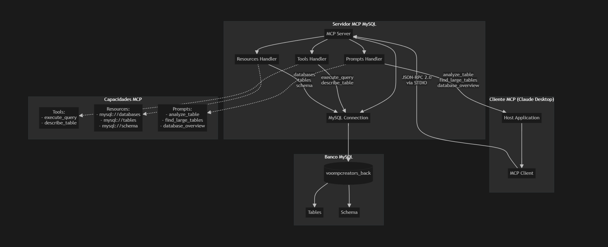

# Servidor MCP MySQL Simples

Este é um servidor MCP (Model Context Protocol) simples para MySQL, criado do zero para demonstrar os conceitos fundamentais do protocolo MCP da Anthropic.

## 🎯 Objetivo

Este projeto foi criado para entender como funciona o protocolo MCP implementando um servidor básico mas funcional que conecta LLMs ao MySQL.

## ✅ Status do Projeto

**✅ FUNCIONANDO CORRETAMENTE** - Servidor MCP testado e operacional  
**✅ CONFIGURAÇÃO FLEXÍVEL** - Suporte a arquivo JSON e variáveis de ambiente  
**✅ DOCUMENTAÇÃO COMPLETA** - Guias detalhados e exemplos de uso  

## 📋 Conceitos MCP Implementados

### 1. **Tools (Ferramentas)**

Funções que o LLM pode executar:

- `execute_query`: Executa queries SQL no banco
- `describe_table`: Descreve a estrutura de uma tabela
- `list_tables`: Lista todas as tabelas do banco

### 2. **Resources (Recursos)**

Dados que o LLM pode acessar:

- `mysql://databases`: Lista todos os bancos de dados
- `mysql://tables`: Lista todas as tabelas do banco atual
- `mysql://schema`: Schema completo do banco

### 3. **Prompts (Templates)**

Templates pré-definidos para o usuário:

- `analyze_table`: Analisa uma tabela específica
- `find_large_tables`: Encontra tabelas com mais registros
- `database_overview`: Visão geral do banco de dados

### 4. **Arquitetura**



## 🚀 Como Usar

### 1. Instalar Dependências

```bash
npm install
```

### 2. Configurar MySQL

O servidor MCP utiliza **exclusivamente as variáveis de ambiente** definidas na configuração do cliente MCP.

**Configuração via Cliente MCP (`claude_desktop_config.json` ou `mcp.json`):**

```json
{
  "mcpServers": {
    "mysql-simple": {
      "command": "node",
      "args": ["C:/Users/seu-usuario/Projetos/mcp-mysql-simple/dist/index.js"],
      "env": {
        "MYSQL_HOST": "seu_host_mysql",
        "MYSQL_PORT": "3306",
        "MYSQL_USER": "seu_usuario",
        "MYSQL_PASS": "sua_senha",
        "MYSQL_DB": "nome_do_banco"
      }
    }
  }
}
```

**Variáveis Suportadas:**
- `MYSQL_HOST` - Host do servidor MySQL
- `MYSQL_PORT` - Porta do MySQL (padrão: 3306)
- `MYSQL_USER` - Usuário para conexão
- `MYSQL_PASSWORD` ou `MYSQL_PASS` - Senha de acesso
- `MYSQL_DATABASE` ou `MYSQL_DB` - Nome do banco de dados

### 3. Compilar o Projeto

```bash
npm run build
```

### 4. Executar o Servidor

```bash
npm start
```

### 5. Para Desenvolvimento

```bash
npm run dev
```

## 🔧 Configuração do Cliente MCP

### Configuração no Claude Desktop

Adicione ao seu `claude_desktop_config.json`:

```json
{
  "mcpServers": {
    "mysql-simple": {
      "command": "node",
      "args": ["C:/Users/seu-usuario/Projetos/mcp-mysql-simple/dist/index.js"],
      "env": {
        "MYSQL_HOST": "seu_host_mysql",
        "MYSQL_PORT": "3306",
        "MYSQL_USER": "seu_usuario",
        "MYSQL_PASS": "sua_senha",
        "MYSQL_DB": "nome_do_banco"
      }
    }
  }
}
```

### Configuração em Outros Clientes MCP

Para outros clientes que usam `mcp.json`:

```json
{
  "mysql-simple": {
    "command": "node",
    "args": ["caminho/para/dist/index.js"],
    "env": {
      "MYSQL_HOST": "seu_host_mysql",
      "MYSQL_PORT": "3306",
      "MYSQL_USER": "seu_usuario",
      "MYSQL_PASS": "sua_senha",
      "MYSQL_DB": "nome_do_banco"
    }
  }
}
```

> **⚠️ Importante:** O servidor MCP **sempre** utilizará as variáveis de ambiente definidas no cliente MCP. Não é necessário criar arquivos de configuração locais no projeto.

## 🛠️ Scripts Disponíveis

| Script | Comando | Descrição |
|--------|---------|-----------|
| **Build** | `npm run build` | Compila o projeto TypeScript |
| **Start** | `npm start` | Inicia o servidor MCP |
| **Dev** | `npm run dev` | Modo desenvolvimento |
| **Test Connection** | `npm run test-connection` | Testa conexão MySQL |
| **Analyze Users** | `npm run analyze-users` | Analisa tabela de usuários |

## 🏗️ Arquitetura do Código

### Estrutura Principal

```typescript
class MySQLMCPServer {
  private server: Server;           // Servidor MCP
  private connection: Connection;   // Conexão MySQL
  private config: MySQLConfig;      // Configuração

  constructor() {
    this.config = this.loadMySQLConfig();
    this.server = new Server({...}, {
      capabilities: {
        tools: {},      // Suporte a ferramentas
        resources: {},  // Suporte a recursos
        prompts: {}     // Suporte a prompts
      }
    });
  }
}
```

### Ciclo de Vida MCP

1. **Inicialização**: Cliente conecta e negocia capacidades
2. **Operação**: Cliente faz requests, servidor responde
3. **Shutdown**: Conexão é encerrada graciosamente

## 📡 Protocolo MCP em Ação

### 1. Teste de Funcionamento

```bash
# Testar listagem de ferramentas
echo '{"jsonrpc":"2.0","method":"tools/list","id":1}' | node dist/index.js

# Resultado esperado:
# ✅ Configuração carregada do arquivo config-mysql.json
# 🚀 Servidor MCP MySQL iniciado! Aguardando conexões...
# {"result":{"tools":[{"name":"execute_query"...}
```

### 2. Mensagens JSON-RPC 2.0

```json
{
  "jsonrpc": "2.0",
  "method": "tools/call",
  "params": {
    "name": "execute_query",
    "arguments": {
      "query": "SELECT COUNT(*) FROM users"
    }
  },
  "id": 1
}
```

## 🔍 Exemplos de Uso

### 1. Executar Query SQL

```sql
SELECT * FROM users LIMIT 5;
```

### 2. Descrever Tabela

```sql
DESCRIBE users;
```

### 3. Listar Tabelas

```sql
SHOW TABLES;
```

## 🛡️ Segurança

### Práticas Implementadas:

- ✅ **Configuração exclusiva via MCP** - Sem arquivos de configuração local
- ✅ **Escape de nomes de tabelas/bancos** com backticks
- ✅ **Tratamento de erros robusto** em todas as operações
- ✅ **Validação de parâmetros** antes da execução
- ✅ **Conexão controlada ao MySQL** com validação
- ✅ **Fechamento gracioso de conexões** com cleanup adequado

### Melhorias Futuras:

- 🔒 Validação de queries SQL (whitelist)
- 🔒 Rate limiting
- 🔒 Autenticação/autorização
- 🔒 Logs de auditoria

## 🧪 Testando o Servidor

### 1. Teste de Conexão

```bash
npm run test-connection
```

### 2. Teste do Servidor MCP

```bash
echo '{"jsonrpc":"2.0","method":"tools/list","id":1}' | npm start
```

### 3. Teste de Análise

```bash
npm run analyze-users
```

## 📚 Documentação Adicional

- [**CORRECOES-MCP.md**](CORRECOES-MCP.md) - Detalhes das correções implementadas

## 🚧 Estrutura de Arquivos

```
mcp-mysql-simple/
├── src/
│   └── index.ts                    # Servidor MCP principal
├── dist/                           # Arquivos compilados
├── docs/                           # Documentação
├── analyze-users-table.js          # Script de análise de usuários
├── test-mysql-connection.js        # Script de teste de conexão
├── package.json                    # Dependências e scripts
└── README.md                       # Este arquivo
```

## 📈 Próximos Passos

Para expandir este servidor:

1. **Adicionar mais Tools**:
   - `create_table`
   - `backup_database`
   - `optimize_table`

2. **Melhorar Resources**:
   - Índices das tabelas
   - Estatísticas de performance
   - Logs de queries

3. **Expandir Prompts**:
   - Templates para relatórios
   - Queries de otimização
   - Análises de performance

4. **Implementar Sampling**:
   - Permitir que o servidor faça requests para o LLM

## 🐛 Solução de Problemas

### Erro: Configurações MySQL Incompletas

```bash
❌ Erro: Configurações MySQL incompletas. Verifique MYSQL_HOST e MYSQL_USER nas variáveis de ambiente do MCP.
```

**Solução**: Verifique se `MYSQL_HOST` e `MYSQL_USER` estão definidos na seção `env` da configuração do cliente MCP.

### Erro: Conexão Recusada

```bash
❌ Erro: ECONNREFUSED
```

**Solução**: Verifique se o MySQL está rodando e as credenciais na configuração MCP estão corretas.

### Erro: Tabela não existe

```bash
❌ Erro: Table 'users' doesn't exist
```

**Solução**: Confirme se a tabela existe no banco de dados especificado na variável `MYSQL_DB`.

### Erro: Compilação

```bash
❌ Erro: TypeScript compilation failed
```

**Solução**: Execute `npm install` para instalar todas as dependências.

## 📖 Referências

- [Documentação MCP Oficial](https://spec.modelcontextprotocol.io/)
- [SDK TypeScript](https://github.com/modelcontextprotocol/typescript-sdk)
- [Exemplos da Anthropic](https://github.com/modelcontextprotocol/servers)

---

**✅ Sistema Testado e Funcionando!**  
**Criado com ❤️ para aprender o protocolo MCP da Anthropic**  
**Versão:** 1.0.0  
**Última atualização:** 10/07/2025
